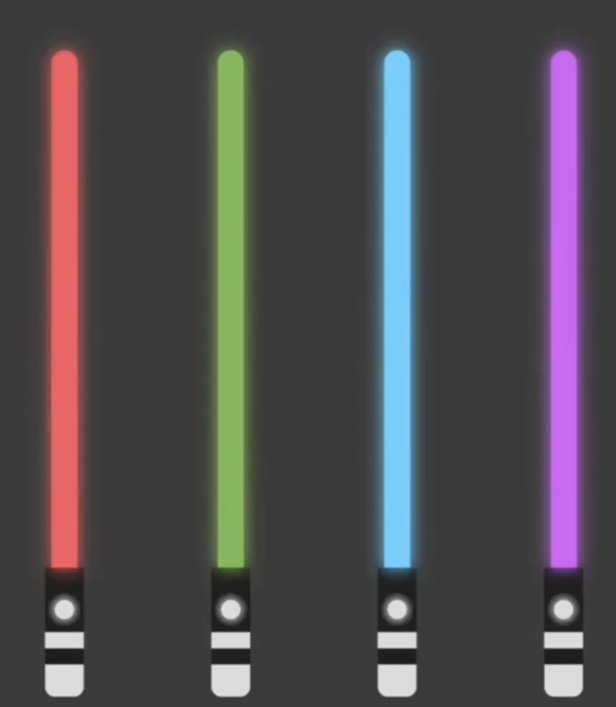
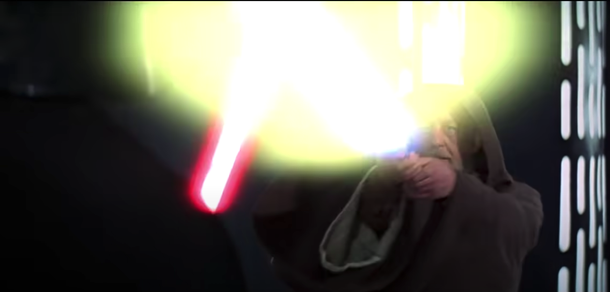

## Starwars light saber

The inspiration here was an instagram post where someone had created with only CSS an animation of several light sabers that just glowed.
Impressed, I wanted to recreate the sabers with an extra interaction, when the mouse hovers the light saber it would flash as if you were fighting with another light saber.

Recreating the saber was the first step and then I watched in slowmotion a video of light sabers fights to understand the visual effects and saw the light explosion movement.
I tried to reproduced it separately and then put it over the saber which resulted in the final experiment below. Don't hesitate to expand the codepen screen !

#### The inspiration (Play at slowest speed to see visual effects)

<YouTube youTubeId="esnMDtMysHo" skipTo={{
  h: 0,
  m: 0,
  s: 21
}} />

#### The experiments

<CodePen codePenId="Qozvqq" />

<CodePen codePenId="drjmNq" />