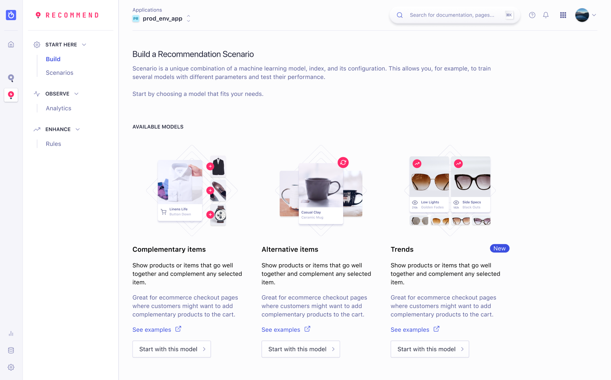
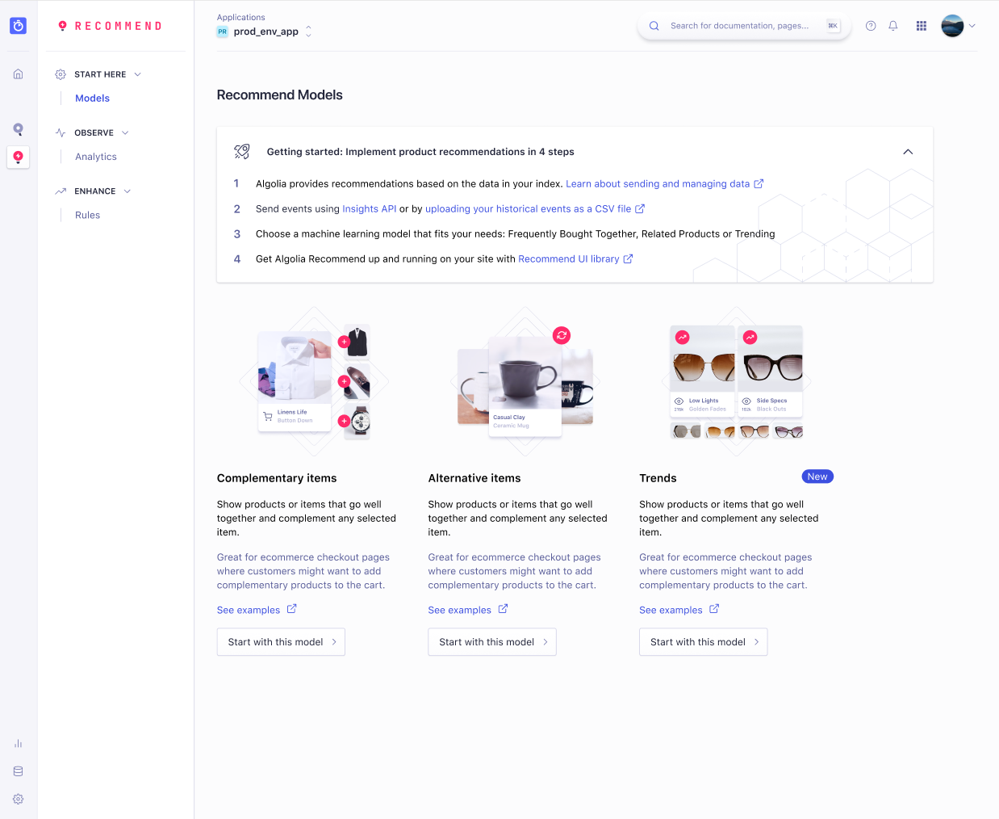
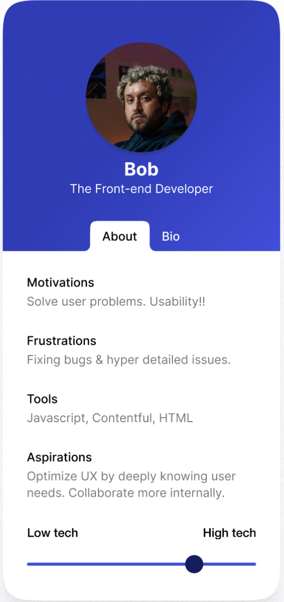
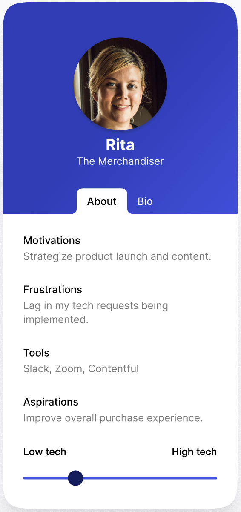
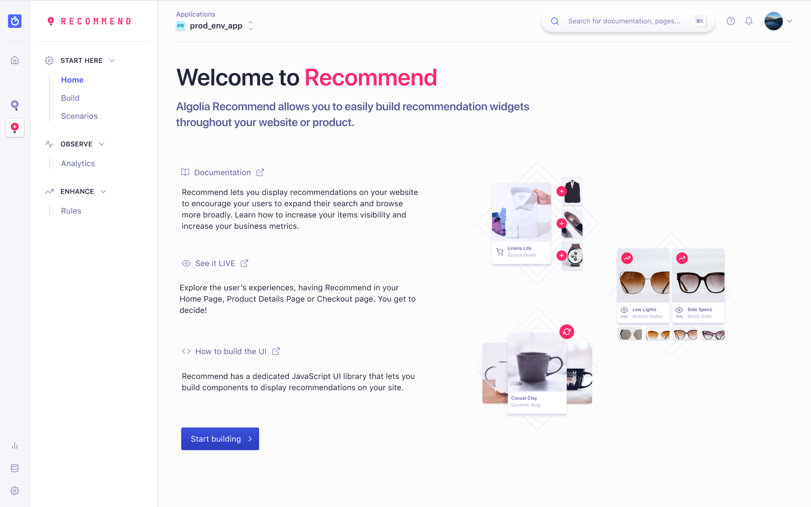
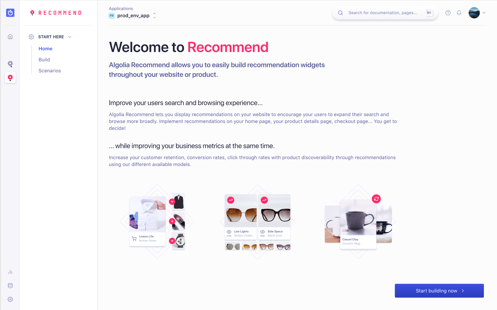
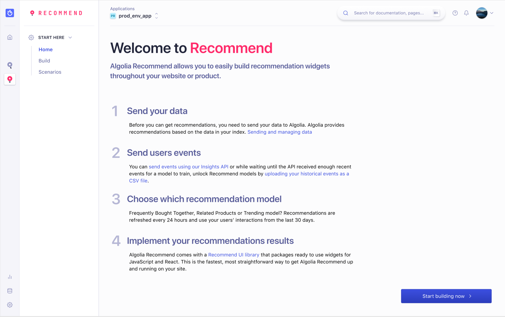
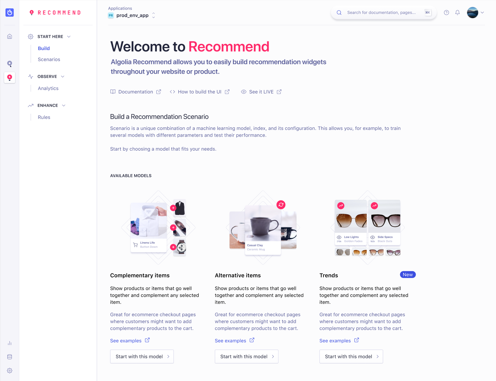
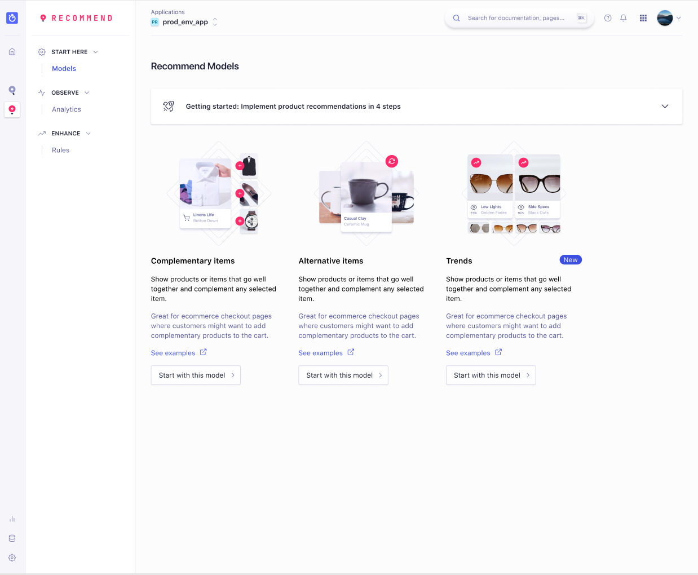

## Before

## After

## Context
In 2021 Algolia launched their second product called Recommend along with their historical one called Search. 
This brought Algolia closer to a multi product platform and triggered a change in company’s vision as well as how sales were going to pitch Algolia to clients.
It also created the challenge to figure out how Recommend should be marketed to existing and new customers.
When we started working on this project, Recommend was thus perceived as a secondary product.

## Problem
Recommend was built and designed to be independent from Search. Product was designed to be a standalone product that could be sold separately from Search.
Yet this criteria was not reflected in the onboarding process of Algolia nor was it indicated in the Recommend Product navigation.
Finally it was a product sales and internal teams struggled to understand and sell to clients. Problem required to be tackled by our revenue enablement team, as much as education, marketing and design.
We needed to find a temporary solution that would guide new and existing customers to the onboarding process of Recommend, without going through Search onboarding.

## Persona
We initially defined 7 persona ranging from product manager, to tech lead or data analyst.
From the existing customer base of Recommend we decided to focus on building an understanding of the problem for developers (technical users) and merchandisers (business users).

## Process
Going through the path of introducing Recommend from the dashboard was a big leap.
In the initial version of Recommend landing page, customers were brought to a screen called Build where to start playing with Recommend.
They needed to start by choosing which model to build. Yet the downside of this approach was it assumed customers already understood Recommend’s product value and were clear about where they were in the experience journey.

We reconsidered this approach and decided to create a new and simple onboarding experience to the Recommend product. Objective was for new customers to understand how to start while for existing customers to know where to pick up. 

Here are the first 4 screen options considered as a potential solution. 

First option was to add a new route to the sidebar navigation called “Home”. Customers would then use this screen as a resource page.

PROs:
* Users can return to this page to find resources or inspirations

* Images are used as anchors to the screen Build where from users can pick the appropriate model

* Experience is similar to a README found on any Github project

CONs:
* A resource page is good for a single visit but unclear what would bring the customer back to this page

* It would be less targeted for the business user persona

Second option was to keep the idea of a new route to the sidebar navigation called “Home” with the added element to use this page as an opportunity to upsell Recommend’s business proposition.

PROs:
*Show new customers and remind existing customers Recommend’s added value 

*Attract self-served customers that don’t go through the sales lifecycle

CONs:
* Customers who adopted or returning ones wouldn’t see the value of this page

* No resource or guiding principle as to how to get started with Recommend

* Page would be more a product marketing upsell page instead of one to trigger action

Third option was about adding a new route to the sidebar navigation of the Recommend product called “Home” and use this screen as an opportunity to show the required steps to play with Recommend.

PROs:
* Page would echo the implementation steps to follow to get Recommend working

* Link would allow to redirect customer to further documentation for each step

* Restrict likeliness for the page to evolve into a smarter automated page (i.e what step are already completed, those who aren't’, analytical data)

CONs:
* Verbose page

* Step 1 and 2 could be redundant depending on the customer’s implementation stage

* Developer persona are unlikely to go from this screen straight to the Build page

Fourth option was about dropping the idea of adding a new route to the sidebar navigation, and instead keep the existing navigation and use the current screen with an enhanced header.

PROs:
* All relevant content in one page

* Customer stays on the page to get started with Recommend without new CTA or extra screen

* No verbose description, only links to resources if needed or as reminders

CONs:
* Many different lines to go through

* Focus is put away from the models section

* Constraints customer to scroll down the page

After considering all of these options, we realized that adding an extra navigation route with an additional screen for returning customers or an added screen with a CTA for new users wasn’t optimal.
It didn’t contribute to solving the customer problem of onboarding efficiently in an easier and more convenient way.
Although the content intended to guide users it actually introduced additional steps to the discoverability of Recommend thereby going against the initial objective.

## Solution
After bringing it to a design critic, gathering feedback from the engineering team and senior peers, we scratched the Recommend “Home” page
and designed with the constraint of keeping the current navigation experience while exploring a new way to welcome customers.
The result below was eventually picked

We chose a component that would be displayed unfold as soon as a customer arrives on the Recommend page that by default was renamed Models.
This component included the 4 implementation steps required to successfully install Recommend in production.
It also embedded available resources for each of those steps so that no matter at which stage of the implementation customer is, they can easily catch up on what to do next.
If the introduction isn’t required, customers can ignore it by folding it and go straight to the choice of the Recommend model.

## Impact/Metrics
With this design we wanted to track each link for each step presented in the introduction card.
With this tracker the objective was to understand which stage of the implementation a customer was at but also what resources were the most useful to them.
We also added a tracker on the fold/unfold component to understand how the customer engaged with this new component.

We did not observe any significant impact on adoption. We could not validate it brought more visibility to Recommend as a standalone product.
This component was only a band-aid to the multiproduct onboarding experience that Algolia needed to resolve with several cross team collaborations.

## Learnings

After 3 months monitoring the number of clicks on the component and its link, the designed experience did not contribute to increasing significantly the product adoption.
Instead of addressing an isolated piece of the onboarding experience we should have addressed the end to end onboarding experience to the Algolia Recommend product instead of adding incremental improvements without enough context or customer feedback.
We should have tested the solution before sending it out in production. 

This design improvement still contributed to helping solution engineers to demo the product to prospects or customer success engineers walking clients through the product.

