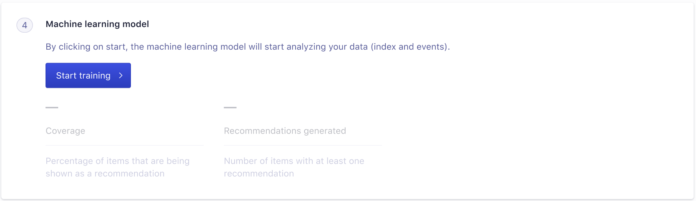

## Context
This was the first task given to me when I joined the design team as a junior product designer and integrated the Recommend product team.
The objective was to include a legal message to be displayed during the configuration process of a Recommend Related Product model.

## Problem
To follow our GDPR compliances and legal obligation we were obliged to add detailed legal information for customers using the Recommend model.
I was told it should be added to the 4th card of the configuration process.

## Persona
Any user using the Recommend Related Product model

## Process
This was the initial component that I was asked to modify:

I had just recently been through an internet scam and because a legal message was not displayed I almost got ripped off !
So I came with several questions when attacking this first task and several solutions waiting on answers from the PM and our legal team.

What is the importance of this legal message? Should it have its own card, its own step in the configuration process? How visible should it be depending on its importance?
Do we want the customer to check a box once the message is read?

What is the legal severity? What are the legal consequences for Algolia if the user doesn't agree or doesn’t see the message? Should we block the process if the user doesn’t agree?

Because the call to action “Start training” is the final step of the configuration the message should probably stay in the 4th card.

## Solution
The PM was out of office for a month, so was our contact in the legal team. A decision had to be made.
After discussing with my senior product designer and the engineer manager we agreed on the solution below for three reasons.
1) This solution has lesser impact on the user experience and won’t block the user in their model configuration and 2) When a user signs up with Algolia they already agree to GDPR compliances and we already asked them permission to use their data.
This message is only a reminder and a more detailed explanation of what we are doing with their data when the user is configuring the model. And 3) The “Start training” button is already our CTA/ user acknowledgement action.

## Impact/Metrics
None were required

## Learnings
The PM is not always here to answer all of the product design questions and a product designer should be able to make a decision without all the perfect answers and perfect settings.
