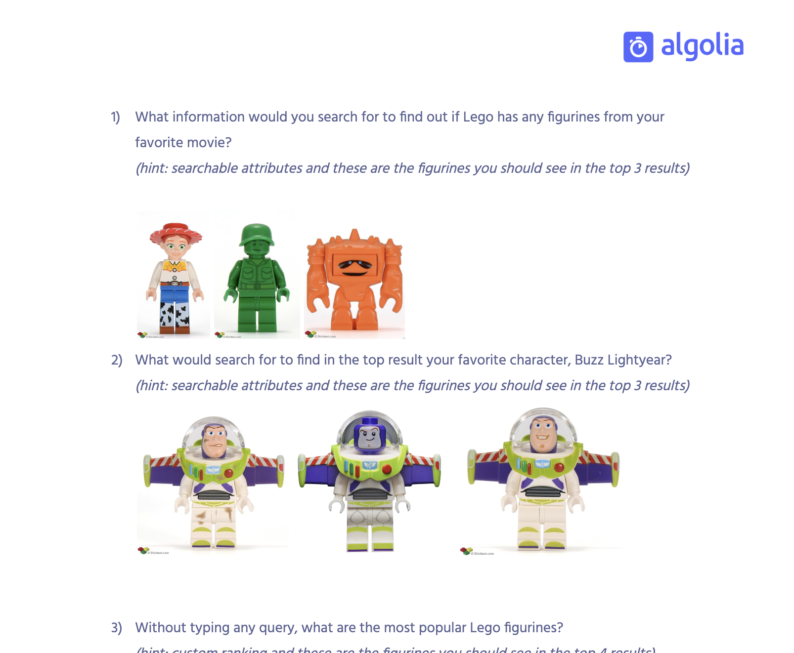
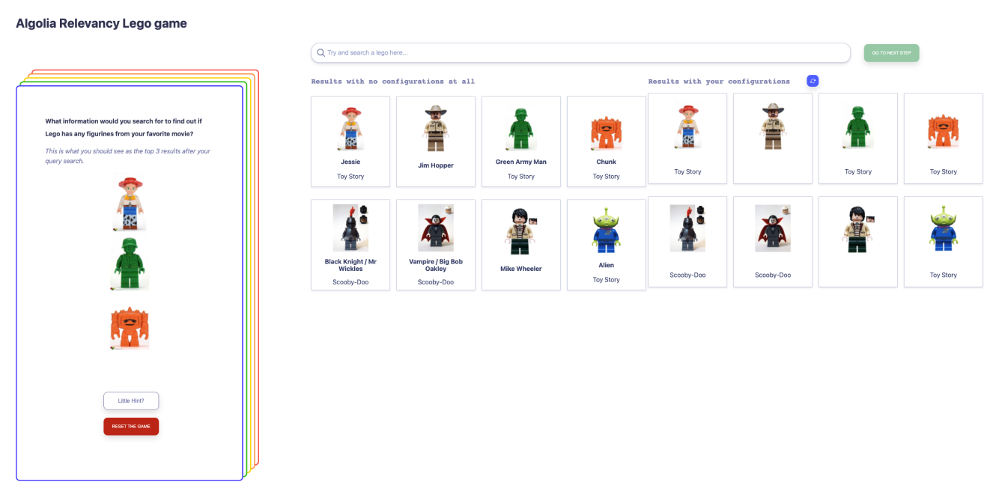
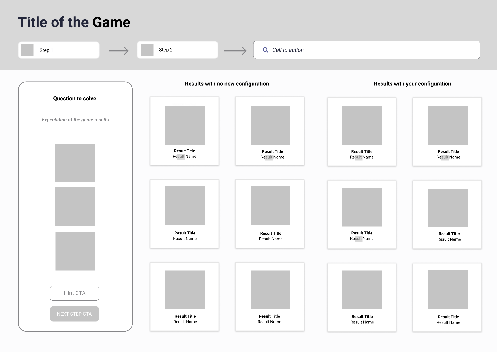
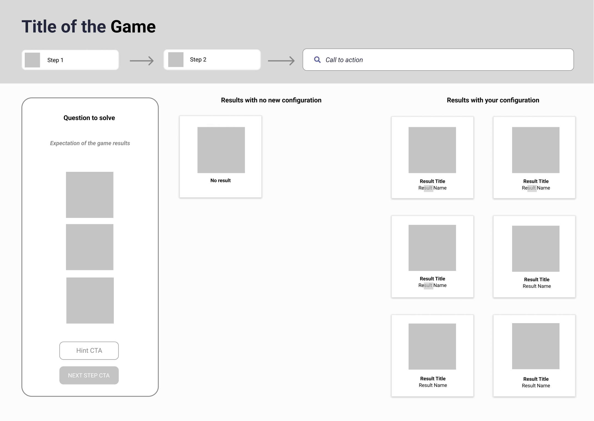
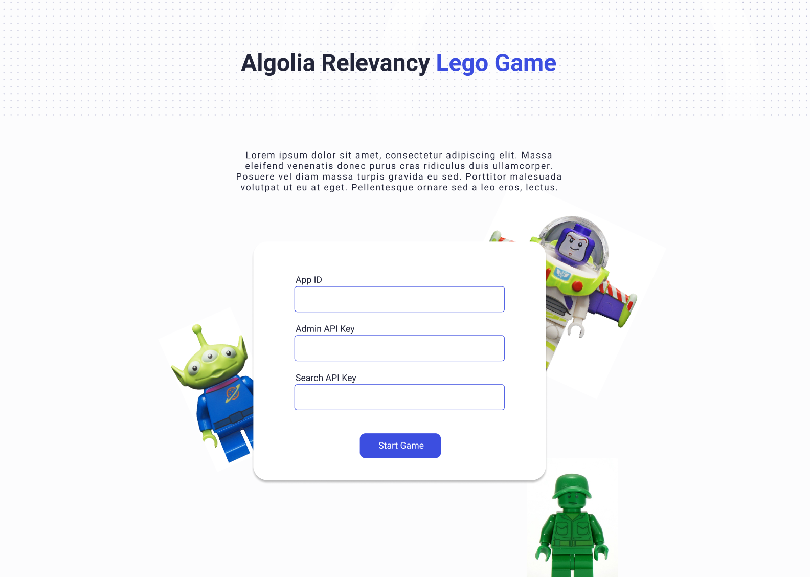
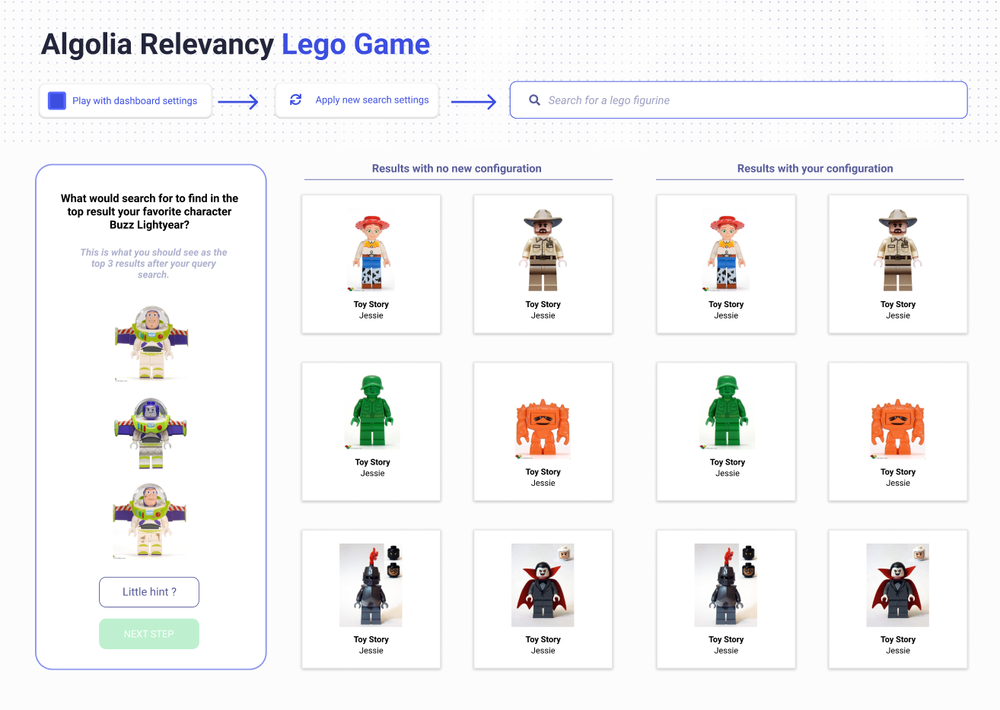
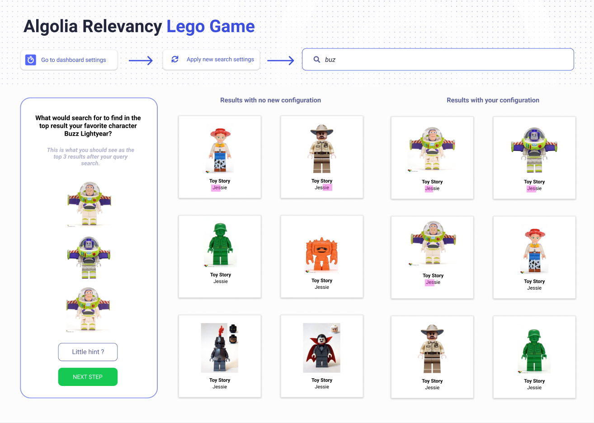
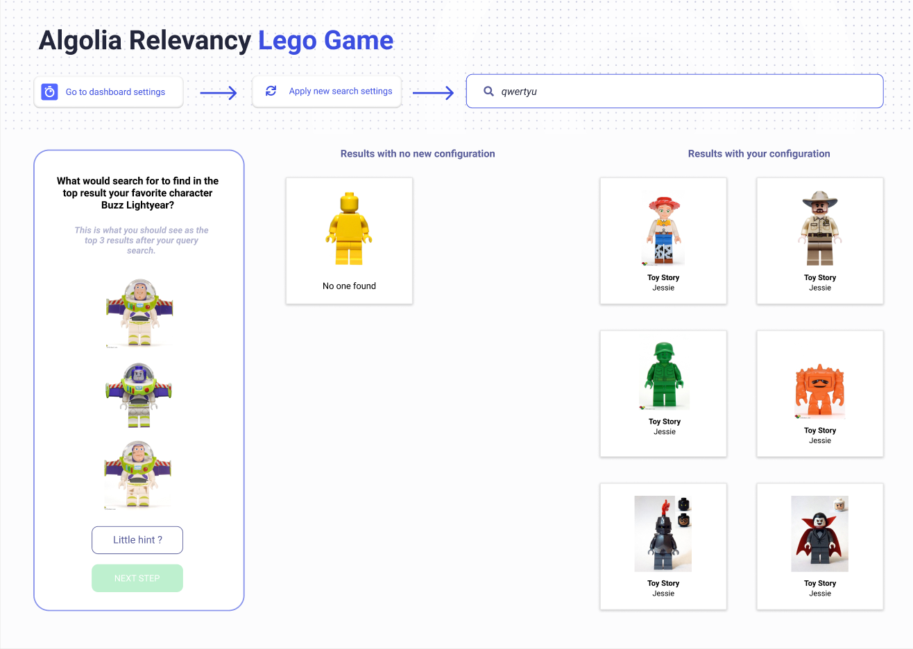

## Context
This project was born during a company hackathon day. Goal was to find creative ideas to solve real customer problems.
I submitted three ideas and pitched them. One caught the attention of a solution architect and a customer success manager whom I started working with.

## Problem
Algolia is a search product. When we bring new customers to Algolia they have to go through a complex onboarding process.
We cater to various roles and profiles such as developers (technical users) or e-commerce managers, marketers, merchandisers (business users).
Customers used to complain about how confusing and bumpy Algolia lingo was but also how key concepts were difficult to understand, thereby leading to unsuccessful implementations.

Our bigger customers can reach out to their CSMs, have a TAM or an SA review their implementation.
For most of our self-served and smaller customers they can only rely on the support team or the documentation to onboard successfully.
Either way the process is time consuming and repetitive for field engineers. It’s also not easy for customers to know what questions to ask the support team or what topic to look for in the documentation.
Without a good understanding and a basic implementation, it’s difficult for customers to pursue the value of Algolia or to continue building with more complex features resulting in unsatisfied customers and sometimes churns.

## Persona
This game is made for any persona discovering Algolia for the first time. It’s for prospects and customers who wish to discover and understand Algolia Search without writing a single line of code or going through heavy documentation.
It would seduce more non technical users, as developers often go straight for the documentation.

## Process
Although Algolia customers are mainly e-commerce businesses we tend to be agnostic of the business profile when onboarding onto Algolia.
Instead, the objective is to allow anyone with a use case to understand how Algolia Search is operating and how they can apply it to their operations.
Because onboarding is segment agnostic the shared goal is to educate the customer around Algolia and make them understand what’s the added value of implementing Algolia Search.

The key word is “education”. What makes a big, new, sometimes complex topic easy to digest? The initial assumption is that gamifying learning is a rewarding and shareable experience for the customer.
Hence came the proposal to build a small game, a game that will take the user step by step on what to understand and how to use Algolia.

Building empathy and stickiness to the game is important for a fast adoption. I decided to use Lego figurines to leverage the endless possibilities and customisation features and funness of the data.

The first version of the game was a written document with simple questions, hints and Lego figurines pictures. A document that could be sent or downloaded by the customer with a data set to interact within the Algolia dashboard.
The pictures are the expected results to the question.
The user would read the document and then try to use the Algolia dashboard and sandbox to visualize the results.

PROs:
* Good start for a game, ask a question, give a hint and expected results to the question. Like a quiz game mixed with finding identical pictures.

CONs:
* The user needs to use several screens in order to accomplish what is needed to solve the question.
* What prevents the user from jumping this question and going to the next one instead?
* Does this solution truly help the customer understand each incremental steps of an implementation?
* Looks more like a list of scoring sheet than a game that can be played independently

Once we narrowed down the vision with the SA and the CSM, we had one hour to develop this document into another format, one that would look like a game application. This was the result.

I designed the experience and helped the SA develop the POC while the CSM continued developing the quiz questions. 

We managed to pitch and present this version, winning the overall best project and best potential solution for Algolia customers. The CCO (chief customer officer) acknowledged the project and thought it would also do great for marketing events.

I pursued the project finishing developing some functional aspects of it on the back-end and front-end, discovering technical limitations and soon enough got stuck because as I experienced it in my past front-end experiences,
you can only go so far without a more researched user experience. These are the screens I ended up with.

The second prototype (first one being the developed POC)

The prototypes with branding and more detailed components

## Solution 
No solutions were validated for this project.

## Impact/Metrics
These are the metrics I wish I could follow with this project, depending on where the game would have lived:
* Number of self-served prospects
* Number of marketing lead pipeline
* Number of support questions sent to the support team around basic search relevancy after doing the game
* Number of users playing the game
* Number of users who are prospects vs current customers
* Customer satisfaction during onboarding

## Next steps
With more time, I would build a detailed user story, for every step of the game. I would create a prototype that would be tested by real customers and collect as much feedback as possible before going through another iteration phase.
With what currently exists, the code and the design could be sufficient for a prototype to validate the potential of this onboarding educational game.

